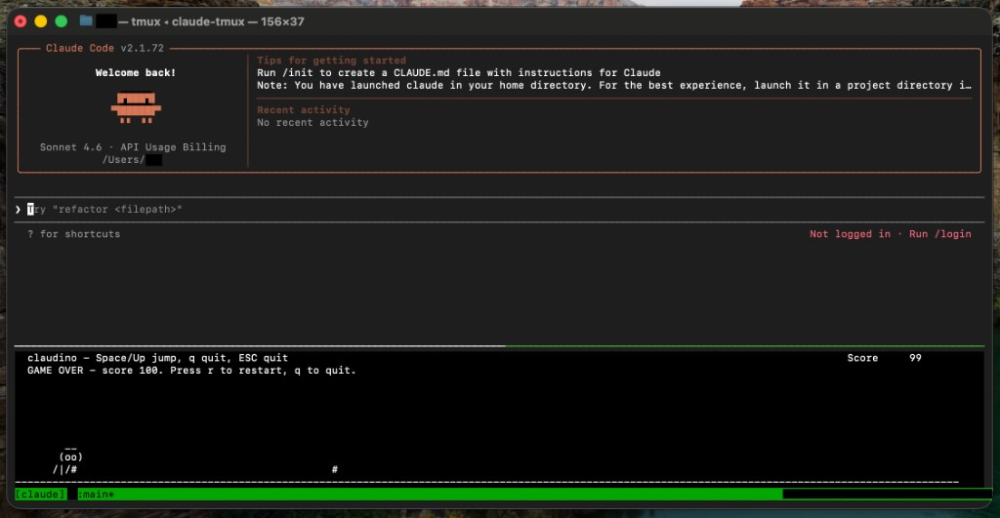

# claudino - fight claude boredom

Next time:
- Claude is down...
- You catch yourself bored, watching Claude prestidigitate in the terminal...

No worries, I got you.
Open claudino:
A tiny terminal dino game you can toggle **while Claude is working**, without messing with Claude's TUI - using **tmux**.

- Toggle pane: `Ctrl+g`
- Jump: `Space` or `Up`
- Quit game: `q` or `Esc`

## Preview



## Requirements

- `python3`
- `tmux`
- `git`

Quick check:

```bash
python3 --version
tmux -V
git --version
```

## Fast install (from any folder)

```bash
git clone https://github.com/mohidbt/claudino.git
cd claudino
chmod +x scripts/install.sh scripts/claudino.py scripts/claude-tmux.sh
./scripts/install.sh
exec "$SHELL" -l
```

Add the tmux toggle binding:

```bash
cat tmux/claudino-toggle.conf >> ~/.tmux.conf
```

Start tmux, load the binding, and run Claude:

```bash
tmux new -A -s claude
tmux source-file ~/.tmux.conf
claude
```

Press `Ctrl+g` anytime to open/close claudino.

## Launching

### Creating claude-tmux command
Install one time:

```bash
install -m 755 scripts/claude-tmux.sh "$HOME/bin/claude-tmux"
```

Use every time:

```bash
claude-tmux
```

### Alternative, if you did not install it:

```bash
tmux new -A -s claude
claude
```

Then use `Ctrl+g` to toggle claudino.

## Troubleshooting

`tmux: command not found`

Install tmux first:

- macOS (Homebrew): `brew install tmux`
- Ubuntu/Debian: `sudo apt update && sudo apt install -y tmux`
- Fedora: `sudo dnf install -y tmux`

`cat tmux/claudino-toggle.conf: No such file or directory`

- You are not inside the cloned repo directory.
- Run `cd claudino` (or your repo path), then try again.

Grey shaded background in tmux:

```tmux
set -g window-style bg=default
set -g window-active-style bg=default
```

Then reload inside tmux:

```bash
tmux source-file ~/.tmux.conf
```

## Files

- `scripts/claudino.py`: the game
- `scripts/install.sh`: installs `claudino` to `~/bin`
- `tmux/claudino-toggle.conf`: `Ctrl+g` toggle keybind
- `scripts/claude-tmux.sh`: optional launcher

## License

MIT
